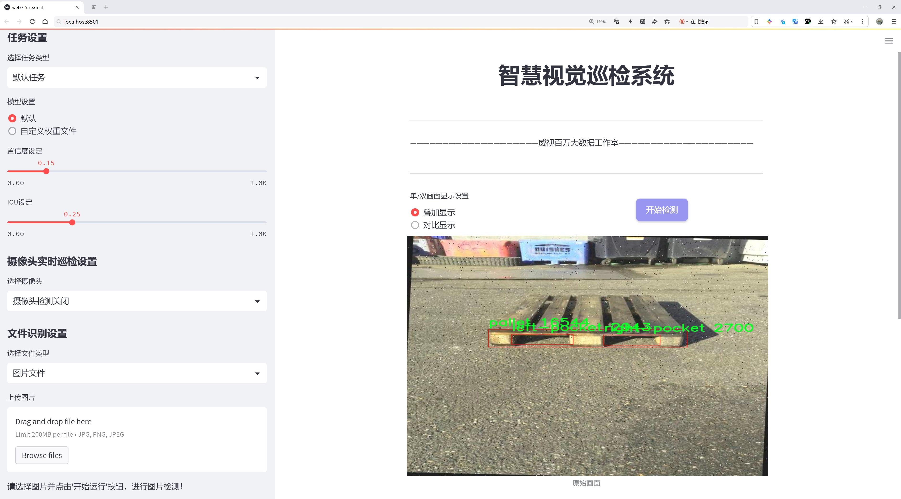
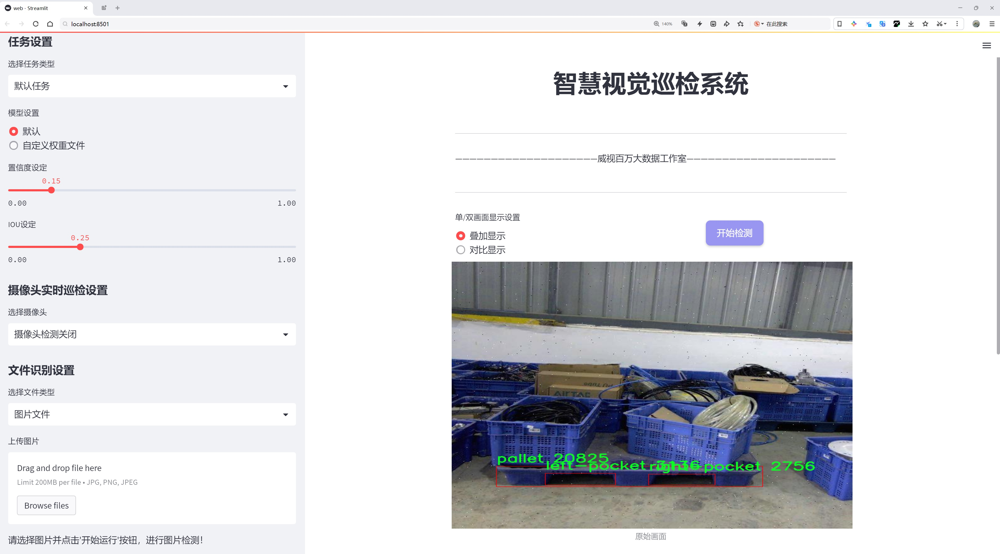
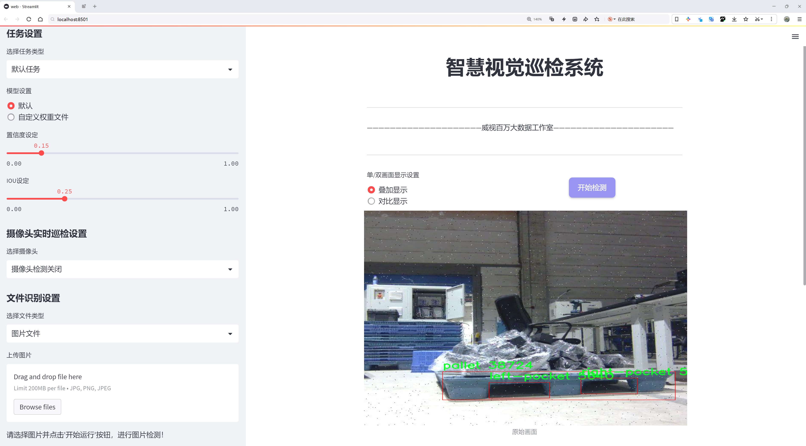
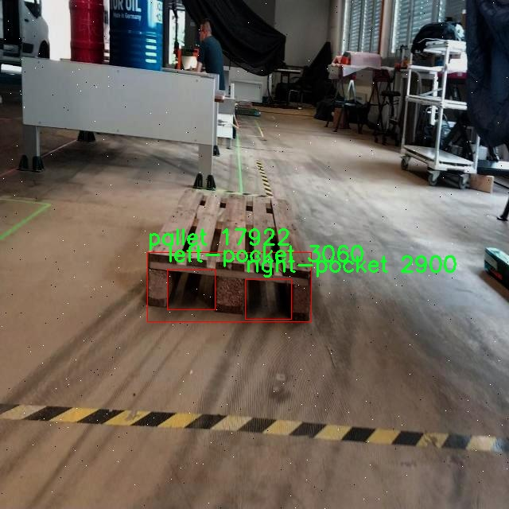
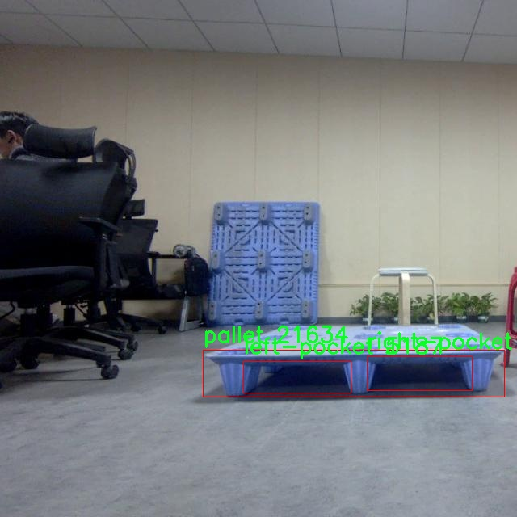
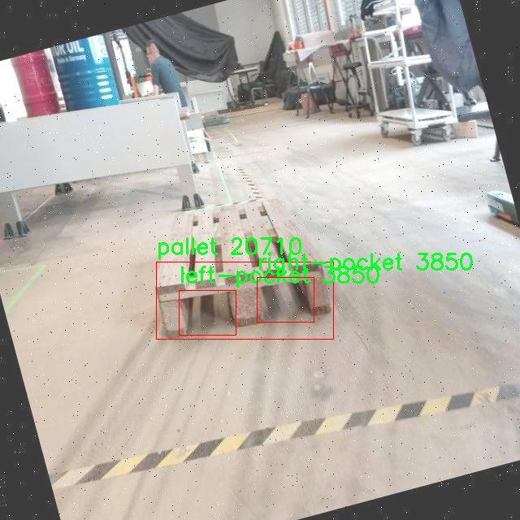
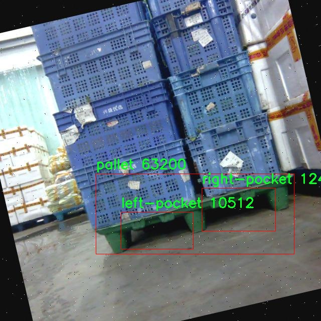
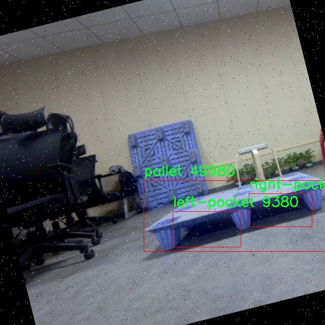

# 托盘检测检测系统源码分享
 # [一条龙教学YOLOV8标注好的数据集一键训练_70+全套改进创新点发刊_Web前端展示]

### 1.研究背景与意义

项目参考[AAAI Association for the Advancement of Artificial Intelligence](https://gitee.com/qunmasj/projects)

项目来源[AACV Association for the Advancement of Computer Vision](https://kdocs.cn/l/cszuIiCKVNis)

研究背景与意义

随着全球物流和供应链管理的迅速发展，托盘作为货物运输和存储的基本单元，其检测与管理的有效性直接影响到物流效率和成本控制。托盘的自动化检测系统在智能仓储、无人驾驶运输车以及工业机器人等领域的应用日益广泛。传统的托盘检测方法多依赖于人工视觉或简单的图像处理技术，难以满足现代物流环境中对实时性和准确性的高要求。因此，基于深度学习的目标检测技术，尤其是YOLO（You Only Look Once）系列模型的引入，为托盘检测提供了新的解决方案。

YOLOv8作为YOLO系列的最新版本，凭借其高效的检测速度和优越的精度，已在多个领域取得了显著的应用效果。然而，YOLOv8在特定场景下的表现仍然存在提升空间，尤其是在复杂背景、不同光照条件以及多种托盘布局的情况下。因此，针对托盘检测的特定需求，对YOLOv8进行改进和优化显得尤为重要。本研究旨在基于改进的YOLOv8模型，构建一个高效的托盘检测系统，以实现对托盘及其相关组件（如左侧口袋和右侧口袋）的精准识别。

本研究所使用的数据集包含5500张图像，涵盖了三类目标：左侧口袋、托盘和右侧口袋。这一数据集的构建不仅为模型的训练提供了丰富的样本，也为后续的模型评估和性能验证奠定了基础。通过对不同类别的目标进行标注和分类，研究将能够有效提升模型对托盘及其附属结构的识别能力。此外，数据集的多样性和复杂性将有助于模型在实际应用中的泛化能力，确保其在不同环境下的稳定性和可靠性。

本研究的意义在于，通过对YOLOv8模型的改进，推动托盘检测技术的进步，提升物流行业的自动化水平。具体而言，改进后的托盘检测系统将能够在实际应用中实现更高的检测精度和更快的处理速度，从而降低人工成本，提高工作效率。同时，该系统的成功应用将为其他领域的目标检测提供借鉴，促进深度学习技术在工业自动化中的广泛应用。

综上所述，基于改进YOLOv8的托盘检测系统不仅具有重要的理论价值，还具备显著的实际应用前景。通过深入研究和优化托盘检测技术，能够为物流行业的智能化转型提供有力支持，推动整个行业向高效、智能的方向发展。这一研究不仅有助于解决当前托盘检测中的技术瓶颈，也为未来的研究提供了新的思路和方向。

### 2.图片演示







##### 注意：由于此博客编辑较早，上面“2.图片演示”和“3.视频演示”展示的系统图片或者视频可能为老版本，新版本在老版本的基础上升级如下：（实际效果以升级的新版本为准）

  （1）适配了YOLOV8的“目标检测”模型和“实例分割”模型，通过加载相应的权重（.pt）文件即可自适应加载模型。

  （2）支持“图片识别”、“视频识别”、“摄像头实时识别”三种识别模式。

  （3）支持“图片识别”、“视频识别”、“摄像头实时识别”三种识别结果保存导出，解决手动导出（容易卡顿出现爆内存）存在的问题，识别完自动保存结果并导出到tempDir中。

  （4）支持Web前端系统中的标题、背景图等自定义修改，后面提供修改教程。

  另外本项目提供训练的数据集和训练教程,暂不提供权重文件（best.pt）,需要您按照教程进行训练后实现图片演示和Web前端界面演示的效果。

### 3.视频演示

[3.1 视频演示](https://www.bilibili.com/video/BV1KHsSeuE4r/)

### 4.数据集信息展示

##### 4.1 本项目数据集详细数据（类别数＆类别名）

nc: 3
names: ['left-pocket', 'pallet', 'right-pocket']


##### 4.2 本项目数据集信息介绍

数据集信息展示

在现代物流和仓储管理中，托盘的高效检测与管理至关重要。为此，我们构建了一个专门用于训练改进YOLOv8托盘检测系统的数据集，命名为“pallet_pocket_detect”。该数据集的设计旨在提高托盘及其相关组件的检测精度，确保在实际应用中能够快速、准确地识别出托盘及其左右两侧的口袋。这一数据集的核心构成包括三个主要类别，分别是“left-pocket”（左口袋）、“pallet”（托盘）和“right-pocket”（右口袋），共计三个类别（nc: 3）。

“pallet_pocket_detect”数据集的创建过程中，我们注重数据的多样性和代表性，确保其能够覆盖各种实际应用场景。数据集中包含了大量不同角度、不同光照条件和不同背景下的托盘及其口袋的图像。这些图像不仅包括标准的托盘形态，还涵盖了在运输、存储和装卸过程中可能出现的各种变形和遮挡情况。通过这种方式，我们希望能够训练出一个更为鲁棒的检测模型，能够在复杂环境中依然保持高效的识别能力。

在数据标注方面，我们采用了精细化的标注策略，确保每一张图像中的托盘及其口袋都被准确标记。左口袋和右口袋的标注不仅考虑了其位置，还考虑了其在不同情况下的形态变化。这种细致的标注工作为模型的训练提供了高质量的监督信号，使得模型能够学习到更为细致的特征，从而提升检测的准确性和可靠性。

此外，为了增强模型的泛化能力，我们在数据集中引入了数据增强技术，包括随机裁剪、旋转、缩放和颜色变换等。这些技术的应用不仅增加了数据集的多样性，还有效防止了模型的过拟合现象，使得训练出的模型能够适应更多的实际应用场景。

“pallet_pocket_detect”数据集的构建和使用，不仅为YOLOv8的改进提供了坚实的基础，也为后续的研究和应用奠定了良好的数据基础。通过对托盘及其口袋的精准检测，我们期望能够在物流自动化、仓储管理等领域实现更高效的操作，提升整体工作效率。

在未来的研究中，我们计划继续扩展该数据集，增加更多的类别和样本，以适应不断变化的市场需求和技术进步。同时，我们也希望通过与行业内的合作，获取更多真实场景下的数据，进一步提升数据集的质量和实用性。通过这些努力，我们相信“pallet_pocket_detect”数据集将成为托盘检测领域的重要资源，为相关技术的发展提供有力支持。











### 5.全套项目环境部署视频教程（零基础手把手教学）

[5.1 环境部署教程链接（零基础手把手教学）](https://www.ixigua.com/7404473917358506534?logTag=c807d0cbc21c0ef59de5)


[5.2 安装Python虚拟环境创建和依赖库安装视频教程链接（零基础手把手教学）](https://www.ixigua.com/7404474678003106304?logTag=1f1041108cd1f708b01a)

### 6.手把手YOLOV8训练视频教程（零基础小白有手就能学会）

[6.1 手把手YOLOV8训练视频教程（零基础小白有手就能学会）](https://www.ixigua.com/7404477157818401292?logTag=d31a2dfd1983c9668658)

### 7.70+种全套YOLOV8创新点代码加载调参视频教程（一键加载写好的改进模型的配置文件）

[7.1 70+种全套YOLOV8创新点代码加载调参视频教程（一键加载写好的改进模型的配置文件）](https://www.ixigua.com/7404478314661806627?logTag=29066f8288e3f4eea3a4)

### 8.70+种全套YOLOV8创新点原理讲解（非科班也可以轻松写刊发刊，V10版本正在科研待更新）

由于篇幅限制，每个创新点的具体原理讲解就不一一展开，具体见下列网址中的创新点对应子项目的技术原理博客网址【Blog】：


[8.1 70+种全套YOLOV8创新点原理讲解链接](https://gitee.com/qunmasj/good)

### 9.系统功能展示（检测对象为举例，实际内容以本项目数据集为准）

图9.1.系统支持检测结果表格显示

  图9.2.系统支持置信度和IOU阈值手动调节

  图9.3.系统支持自定义加载权重文件best.pt(需要你通过步骤5中训练获得)

  图9.4.系统支持摄像头实时识别

  图9.5.系统支持图片识别

  图9.6.系统支持视频识别

  图9.7.系统支持识别结果文件自动保存

  图9.8.系统支持Excel导出检测结果数据


### 10.原始YOLOV8算法原理

原始YOLOv8算法原理

YOLOv8算法是目标检测领域中的一项重要创新，代表了在YOLO系列算法中的又一次重大进步。自从YOLOv1首次提出以来，YOLO系列算法不断演化，逐步克服了传统目标检测方法中的许多局限性。YOLOv8于2023年1月10日由Ultralytics公司发布，其设计理念旨在提高目标检测的精度和速度，尤其是在复杂场景下的表现。YOLOv8在YOLOv7的基础上进行了多方面的优化，形成了一种更为高效的卷积神经网络（CNN）结构。

YOLOv8的核心思想是将整个图像作为输入，直接在图像上进行目标检测和定位。这一方法的优点在于，它避免了传统方法中常用的滑动窗口和区域提议技术，从而显著提高了检测的速度和效率。YOLOv8通过引入更深的卷积神经网络结构，增强了特征提取的能力，使得算法能够更好地捕捉到图像中的细节信息。此外，YOLOv8还采用了多尺度训练和测试的策略，使得模型在不同尺寸的目标检测上表现得更加稳健。

在YOLOv8的架构中，特征金字塔网络（FPN）被广泛应用，以便在不同的特征层次上进行信息融合。这种设计允许模型在处理不同尺度的目标时，能够有效地利用各层的特征信息，从而提升检测的准确性。YOLOv8还优化了跨级结构（Cross Stage Partial, CSP），通过引入更轻量的模块来减少计算复杂度，同时保持了模型的表达能力。这种优化使得YOLOv8在保持高精度的同时，能够在实时应用中实现更高的帧率。

YOLOv8在损失函数的设计上也进行了创新，采用了新的损失策略。通过变焦损失计算分类损失，结合数据平均保真度损失和完美交并比损失来计算边界框损失，这一策略使得模型在训练过程中能够更准确地优化目标检测的性能。这种改进使得YOLOv8在面对复杂背景和遮挡物时，依然能够保持较高的检测精度。

与其他目标检测算法相比，YOLOv8在精度和速度上均有显著提升。例如，与SSD算法相比，YOLOv8的精度提高了43.23%，而帧率则提升了10.28倍。这种显著的性能提升使得YOLOv8在各种应用场景中都展现出了良好的适应性，包括智能监控、自动驾驶以及人脸识别等领域。

YOLOv8的设计不仅关注算法的性能，还考虑到了实际应用中的可扩展性和灵活性。通过引入注意力机制，YOLOv8能够更好地关注图像中的重要区域，从而进一步提升目标检测的准确性。这种机制的引入，使得YOLOv8在处理复杂场景时，能够更有效地抑制背景噪声，聚焦于目标物体本身。

在实际应用中，YOLOv8的优势不仅体现在理论上的性能提升，更在于其广泛的适用性和高效的实时处理能力。无论是在高流量的监控场景中，还是在需要快速反应的自动驾驶系统中，YOLOv8都能够提供可靠的目标检测支持。通过对YOLOv8算法的深入研究和改进，研究者们可以在特定领域内实现更高效的目标检测解决方案，例如在口罩规范佩戴检测系统中，YOLOv8的高精度和高帧率特性为系统的有效性提供了强有力的保障。

综上所述，YOLOv8算法通过多方面的创新和优化，成功地提升了目标检测的性能，成为当前最先进的目标检测算法之一。其深度卷积神经网络结构、多尺度训练和测试、特征金字塔网络、创新的损失策略以及注意力机制的引入，使得YOLOv8在复杂场景下依然能够保持高效的检测能力。随着YOLOv8的不断发展和应用，其在目标检测领域的影响力将持续扩大，为各类智能应用提供更加精准和高效的解决方案。


### 11.项目核心源码讲解（再也不用担心看不懂代码逻辑）

#### 11.1 70+种YOLOv8算法改进源码大全和调试加载训练教程（非必要）\ultralytics\solutions\ai_gym.py

以下是对代码的核心部分进行提炼和详细注释的版本：

```python
# 导入必要的库
import cv2
from ultralytics.utils.plotting import Annotator

class AIGym:
    """用于管理基于姿势的实时视频流中的健身步骤的类。"""

    def __init__(self):
        """初始化 AIGym，设置默认的视觉和图像参数。"""
        self.im0 = None  # 当前帧图像
        self.tf = None   # 线条厚度
        self.keypoints = None  # 姿势关键点
        self.poseup_angle = None  # 上升姿势的角度阈值
        self.posedown_angle = None  # 下降姿势的角度阈值
        self.threshold = 0.001  # 阈值，用于判断

        # 存储阶段、计数和角度信息
        self.angle = None  # 当前角度
        self.count = None  # 当前计数
        self.stage = None  # 当前阶段
        self.pose_type = 'pushup'  # 姿势类型（如俯卧撑）
        self.kpts_to_check = None  # 需要检查的关键点

        self.view_img = False  # 是否显示图像
        self.annotator = None  # Annotator对象，用于绘制

    def set_args(self, kpts_to_check, line_thickness=2, view_img=False, pose_up_angle=145.0, pose_down_angle=90.0, pose_type='pullup'):
        """
        配置 AIGym 的参数。
        Args:
            kpts_to_check (list): 用于计数的3个关键点
            line_thickness (int): 边界框的线条厚度
            view_img (bool): 是否显示图像
            pose_up_angle (float): 上升姿势的角度
            pose_down_angle (float): 下降姿势的角度
            pose_type (str): 姿势类型，如 "pushup", "pullup" 或 "abworkout"
        """
        self.kpts_to_check = kpts_to_check  # 设置需要检查的关键点
        self.tf = line_thickness  # 设置线条厚度
        self.view_img = view_img  # 设置是否显示图像
        self.poseup_angle = pose_up_angle  # 设置上升姿势的角度
        self.posedown_angle = pose_down_angle  # 设置下降姿势的角度
        self.pose_type = pose_type  # 设置姿势类型

    def start_counting(self, im0, results, frame_count):
        """
        计数健身步骤的函数。
        Args:
            im0 (ndarray): 当前视频流帧
            results: 姿势估计数据
            frame_count: 当前帧计数
        """
        self.im0 = im0  # 保存当前帧图像
        if frame_count == 1:
            # 初始化计数、角度和阶段
            self.count = [0] * len(results[0])
            self.angle = [0] * len(results[0])
            self.stage = ['-' for _ in results[0]]
        
        self.keypoints = results[0].keypoints.data  # 获取关键点数据
        self.annotator = Annotator(im0, line_width=2)  # 创建Annotator对象

        # 遍历每个关键点
        for ind, k in enumerate(reversed(self.keypoints)):
            # 计算姿势角度
            self.angle[ind] = self.annotator.estimate_pose_angle(
                k[int(self.kpts_to_check[0])].cpu(),
                k[int(self.kpts_to_check[1])].cpu(),
                k[int(self.kpts_to_check[2])].cpu()
            )
            self.im0 = self.annotator.draw_specific_points(k, self.kpts_to_check, shape=(640, 640), radius=10)

            # 根据姿势类型更新阶段和计数
            if self.pose_type == 'pushup':
                if self.angle[ind] > self.poseup_angle:
                    self.stage[ind] = 'up'
                if self.angle[ind] < self.posedown_angle and self.stage[ind] == 'up':
                    self.stage[ind] = 'down'
                    self.count[ind] += 1

            elif self.pose_type == 'pullup':
                if self.angle[ind] > self.poseup_angle:
                    self.stage[ind] = 'down'
                if self.angle[ind] < self.posedown_angle and self.stage[ind] == 'down':
                    self.stage[ind] = 'up'
                    self.count[ind] += 1

            # 绘制角度、计数和阶段信息
            self.annotator.plot_angle_and_count_and_stage(
                angle_text=self.angle[ind],
                count_text=self.count[ind],
                stage_text=self.stage[ind],
                center_kpt=k[int(self.kpts_to_check[1])],
                line_thickness=self.tf
            )

            # 绘制关键点
            self.annotator.kpts(k, shape=(640, 640), radius=1, kpt_line=True)

        # 如果需要显示图像，则展示当前帧
        if self.view_img:
            cv2.imshow('Ultralytics YOLOv8 AI GYM', self.im0)
            if cv2.waitKey(1) & 0xFF == ord('q'):
                return

# 主程序入口
if __name__ == '__main__':
    AIGym()  # 创建 AIGym 实例
```

### 代码核心部分说明：
1. **类的定义**：`AIGym`类用于管理健身动作的计数和状态。
2. **初始化方法**：设置了一些默认参数，包括图像、关键点、角度阈值等。
3. **参数设置方法**：`set_args`方法用于配置关键点、线条厚度、显示图像的选项等。
4. **计数方法**：`start_counting`方法是核心功能，负责处理每一帧图像，计算姿势角度，更新计数和阶段，并绘制相关信息。
5. **显示图像**：如果设置了显示图像的选项，则在窗口中展示当前帧图像。

这个文件定义了一个名为 `AIGym` 的类，主要用于在实时视频流中基于人体姿态来管理健身动作的计数。该类的设计目的是通过分析视频帧中的关键点，来判断用户是否完成了特定的健身动作（如俯卧撑、引体向上或腹部锻炼），并进行计数。

在 `__init__` 方法中，类的实例被初始化，设置了一些默认值，包括图像、线条厚度、关键点、角度、计数和姿态等信息。`self.kpts_to_check` 用于存储需要检查的关键点，`self.pose_type` 则指明了当前要检测的动作类型。

`set_args` 方法用于配置一些参数，包括需要检查的关键点、线条厚度、是否显示图像、以及上下姿态的角度阈值等。这些参数可以根据用户的需求进行调整，以适应不同的健身动作。

`start_counting` 方法是该类的核心功能，负责处理每一帧图像并进行动作计数。首先，它会将当前帧图像和姿态估计结果存储到实例变量中。如果是第一帧，它会初始化计数、角度和阶段信息。接着，它会遍历每个关键点，使用 `Annotator` 类来估计姿态角度，并绘制特定的关键点。

根据不同的姿态类型（如俯卧撑、引体向上和腹部锻炼），程序会判断当前的角度是否符合上下动作的标准，并更新计数和阶段信息。每次更新后，程序会调用 `plot_angle_and_count_and_stage` 方法在图像上绘制当前的角度、计数和阶段信息。

最后，如果设置了 `view_img` 为真，程序会使用 OpenCV 显示当前处理的图像，并在按下 'q' 键时退出显示。

整个类的设计使得它能够实时分析用户的健身动作，并通过视觉反馈帮助用户了解自己的锻炼情况。

#### 11.2 70+种YOLOv8算法改进源码大全和调试加载训练教程（非必要）\ultralytics\utils\callbacks\comet.py

以下是代码中最核心的部分，并附上详细的中文注释：

```python
# 导入必要的库
from ultralytics.utils import LOGGER, RANK, SETTINGS, TESTS_RUNNING, ops
import os
from pathlib import Path

# 确保在非测试环境下运行，并且已启用Comet集成
try:
    assert not TESTS_RUNNING  # 确保不是在pytest测试中
    assert SETTINGS['comet'] is True  # 确保Comet集成已启用
    import comet_ml  # 导入Comet库

    assert hasattr(comet_ml, '__version__')  # 确保comet_ml是一个有效的包

except (ImportError, AssertionError):
    comet_ml = None  # 如果导入失败，则将comet_ml设置为None

def _create_experiment(args):
    """在分布式训练中确保实验对象仅在单个进程中创建。"""
    if RANK not in (-1, 0):  # 仅在主进程中创建实验
        return
    try:
        comet_mode = _get_comet_mode()  # 获取Comet模式
        _project_name = os.getenv('COMET_PROJECT_NAME', args.project)  # 获取项目名称
        experiment = _get_experiment_type(comet_mode, _project_name)  # 创建实验对象
        experiment.log_parameters(vars(args))  # 记录参数
        # 记录其他设置
        experiment.log_others({
            'eval_batch_logging_interval': _get_eval_batch_logging_interval(),
            'log_confusion_matrix_on_eval': _should_log_confusion_matrix(),
            'log_image_predictions': _should_log_image_predictions(),
            'max_image_predictions': _get_max_image_predictions_to_log(),
        })
        experiment.log_other('Created from', 'yolov8')  # 记录创建来源

    except Exception as e:
        LOGGER.warning(f'WARNING ⚠️ Comet安装但未正确初始化，未记录此运行。{e}')  # 记录警告信息

def on_train_end(trainer):
    """训练结束时执行的操作。"""
    experiment = comet_ml.get_global_experiment()  # 获取全局实验对象
    if not experiment:
        return  # 如果没有实验对象，则返回

    metadata = _fetch_trainer_metadata(trainer)  # 获取训练器元数据
    curr_epoch = metadata['curr_epoch']  # 当前epoch
    curr_step = metadata['curr_step']  # 当前步骤
    plots = trainer.args.plots  # 获取绘图参数

    _log_model(experiment, trainer)  # 记录模型
    if plots:
        _log_plots(experiment, trainer)  # 记录绘图

    _log_confusion_matrix(experiment, trainer, curr_step, curr_epoch)  # 记录混淆矩阵
    _log_image_predictions(experiment, trainer.validator, curr_step)  # 记录图像预测
    experiment.end()  # 结束实验

    global _comet_image_prediction_count
    _comet_image_prediction_count = 0  # 重置图像预测计数

# 回调函数字典
callbacks = {
    'on_train_end': on_train_end  # 训练结束时的回调
} if comet_ml else {}
```

### 代码说明：
1. **导入模块**：导入必要的库和模块，包括`ultralytics`和`comet_ml`，用于记录训练过程中的各种信息。
2. **环境检查**：确保在非测试环境下运行，并且Comet集成已启用。
3. **创建实验**：在训练开始时创建Comet实验对象，并记录相关参数和设置。
4. **训练结束处理**：在训练结束时，记录模型、混淆矩阵和图像预测，并结束实验。

这段代码的核心功能是与Comet进行集成，记录YOLO模型训练过程中的重要信息，以便后续分析和可视化。

这个程序文件是用于集成Comet.ml的YOLOv8训练过程中的回调函数，主要负责在训练过程中记录和可视化模型的训练和评估结果。首先，文件导入了一些必要的模块和库，包括Ultralytics的工具和Comet.ml库。它确保在测试运行时不记录日志，并验证Comet集成是否启用。

文件中定义了一系列辅助函数，用于获取环境变量中的设置，如Comet的模式、模型名称、评估批次日志记录间隔、最大图像预测数量等。这些设置帮助用户自定义日志记录的行为。程序还提供了函数来判断是否需要记录混淆矩阵和图像预测。

在创建实验的过程中，程序确保在分布式训练中只在一个进程中创建实验对象，并记录训练参数和其他设置。文件还包含了用于处理训练元数据的函数，这些元数据包括当前的训练周期、步骤以及是否需要保存模型资产。

对于图像的处理，程序提供了将YOLOv8训练中生成的边界框标注从缩放后的图像形状转换回原始图像形状的功能。同时，程序还格式化真实标签和模型预测的注释，以便于在Comet中进行可视化。

在训练的不同阶段，程序会记录混淆矩阵、图像和模型信息。特别是在每个训练周期结束时，程序会记录当前的训练指标、学习率以及模型的最佳状态。最后，在训练结束时，程序会结束Comet实验并重置图像预测计数。

整个文件的结构和功能设计旨在确保在YOLOv8的训练过程中，用户能够方便地记录和分析模型的性能，并通过Comet.ml进行可视化，帮助用户更好地理解和优化模型。

#### 11.3 70+种YOLOv8算法改进源码大全和调试加载训练教程（非必要）\ultralytics\models\yolo\segment\train.py

以下是代码中最核心的部分，并附上详细的中文注释：

```python
from ultralytics.models import yolo
from ultralytics.nn.tasks import SegmentationModel
from ultralytics.utils import DEFAULT_CFG, RANK
from ultralytics.utils.plotting import plot_images, plot_results

class SegmentationTrainer(yolo.detect.DetectionTrainer):
    """
    扩展DetectionTrainer类，用于基于分割模型的训练。
    """

    def __init__(self, cfg=DEFAULT_CFG, overrides=None, _callbacks=None):
        """初始化SegmentationTrainer对象，接受配置参数和覆盖参数。"""
        if overrides is None:
            overrides = {}
        overrides['task'] = 'segment'  # 设置任务类型为分割
        super().__init__(cfg, overrides, _callbacks)  # 调用父类构造函数

    def get_model(self, cfg=None, weights=None, verbose=True):
        """返回使用指定配置和权重初始化的SegmentationModel模型。"""
        model = SegmentationModel(cfg, ch=3, nc=self.data['nc'], verbose=verbose and RANK == -1)
        if weights:
            model.load(weights)  # 如果提供了权重，则加载权重

        return model  # 返回初始化的模型

    def get_validator(self):
        """返回用于YOLO模型验证的SegmentationValidator实例。"""
        self.loss_names = 'box_loss', 'seg_loss', 'cls_loss', 'dfl_loss'  # 定义损失名称
        return yolo.segment.SegmentationValidator(self.test_loader, save_dir=self.save_dir, args=copy(self.args))

    def plot_training_samples(self, batch, ni):
        """创建训练样本图像的绘图，包括标签和框坐标。"""
        plot_images(batch['img'],
                    batch['batch_idx'],
                    batch['cls'].squeeze(-1),
                    batch['bboxes'],
                    batch['masks'],
                    paths=batch['im_file'],
                    fname=self.save_dir / f'train_batch{ni}.jpg',
                    on_plot=self.on_plot)

    def plot_metrics(self):
        """绘制训练和验证指标。"""
        plot_results(file=self.csv, segment=True, on_plot=self.on_plot)  # 保存结果为results.png
```

### 代码注释说明：
1. **导入必要的模块**：引入YOLO模型、分割模型、默认配置、绘图工具等。
2. **SegmentationTrainer类**：该类继承自`DetectionTrainer`，用于实现分割任务的训练。
3. **构造函数`__init__`**：初始化时设置任务类型为分割，并调用父类的构造函数。
4. **`get_model`方法**：根据配置和权重返回一个分割模型实例，支持加载预训练权重。
5. **`get_validator`方法**：返回一个用于验证的分割验证器实例，并定义损失名称。
6. **`plot_training_samples`方法**：绘制训练样本的图像，包括图像、标签、边框和掩码，并保存为图像文件。
7. **`plot_metrics`方法**：绘制训练和验证过程中的指标，并保存结果图像。

该程序文件是用于YOLOv8模型的分割任务训练的实现，继承自YOLO的检测训练器。首先，文件导入了一些必要的模块和类，包括YOLO模型、分割模型、默认配置、排名信息以及用于绘图的工具。

在`SegmentationTrainer`类中，首先定义了一个构造函数`__init__`，该函数接受配置参数、覆盖参数和回调函数。构造函数中，若未提供覆盖参数，则初始化为空字典，并将任务类型设置为“segment”，然后调用父类的构造函数进行初始化。

`get_model`方法用于返回一个初始化的分割模型，接受配置和权重参数。如果提供了权重，则加载相应的权重。该方法确保模型的通道数为3，并根据数据集的类别数量进行初始化。

`get_validator`方法返回一个分割验证器的实例，用于验证YOLO模型的性能。在该方法中，定义了损失名称，包括框损失、分割损失、分类损失和DFL损失。

`plot_training_samples`方法用于绘制训练样本图像，包括标签和框坐标。它接收一个批次的数据和批次索引，利用`plot_images`函数生成图像，并将其保存到指定的目录中。

最后，`plot_metrics`方法用于绘制训练和验证的指标，通过调用`plot_results`函数来生成结果图像并保存。

整体来看，该文件提供了一个完整的框架，用于训练YOLOv8的分割模型，包括模型初始化、验证、样本绘制和指标可视化等功能。

#### 11.4 train.py

以下是经过简化和注释的核心代码部分：

```python
import random
import numpy as np
import torch.nn as nn
from ultralytics.data import build_dataloader, build_yolo_dataset
from ultralytics.engine.trainer import BaseTrainer
from ultralytics.models import yolo
from ultralytics.nn.tasks import DetectionModel
from ultralytics.utils import LOGGER, RANK
from ultralytics.utils.torch_utils import de_parallel, torch_distributed_zero_first

class DetectionTrainer(BaseTrainer):
    """
    基于检测模型的训练类，继承自BaseTrainer类。
    """

    def build_dataset(self, img_path, mode="train", batch=None):
        """
        构建YOLO数据集。

        参数:
            img_path (str): 包含图像的文件夹路径。
            mode (str): 模式，`train`表示训练模式，`val`表示验证模式。
            batch (int, optional): 批次大小，适用于`rect`模式。默认为None。
        """
        gs = max(int(de_parallel(self.model).stride.max() if self.model else 0), 32)
        return build_yolo_dataset(self.args, img_path, batch, self.data, mode=mode, rect=mode == "val", stride=gs)

    def get_dataloader(self, dataset_path, batch_size=16, rank=0, mode="train"):
        """构造并返回数据加载器。"""
        assert mode in ["train", "val"]
        with torch_distributed_zero_first(rank):  # 仅在DDP情况下初始化数据集
            dataset = self.build_dataset(dataset_path, mode, batch_size)
        shuffle = mode == "train"  # 训练模式下打乱数据
        workers = self.args.workers if mode == "train" else self.args.workers * 2
        return build_dataloader(dataset, batch_size, workers, shuffle, rank)  # 返回数据加载器

    def preprocess_batch(self, batch):
        """对图像批次进行预处理，包括缩放和转换为浮点数。"""
        batch["img"] = batch["img"].to(self.device, non_blocking=True).float() / 255  # 将图像转换为浮点数并归一化
        if self.args.multi_scale:  # 如果启用多尺度
            imgs = batch["img"]
            sz = (
                random.randrange(self.args.imgsz * 0.5, self.args.imgsz * 1.5 + self.stride)
                // self.stride
                * self.stride
            )  # 随机选择图像大小
            sf = sz / max(imgs.shape[2:])  # 计算缩放因子
            if sf != 1:
                ns = [
                    math.ceil(x * sf / self.stride) * self.stride for x in imgs.shape[2:]
                ]  # 计算新的图像形状
                imgs = nn.functional.interpolate(imgs, size=ns, mode="bilinear", align_corners=False)  # 调整图像大小
            batch["img"] = imgs
        return batch

    def get_model(self, cfg=None, weights=None, verbose=True):
        """返回YOLO检测模型。"""
        model = DetectionModel(cfg, nc=self.data["nc"], verbose=verbose and RANK == -1)
        if weights:
            model.load(weights)  # 加载模型权重
        return model

    def plot_training_samples(self, batch, ni):
        """绘制带有注释的训练样本。"""
        plot_images(
            images=batch["img"],
            batch_idx=batch["batch_idx"],
            cls=batch["cls"].squeeze(-1),
            bboxes=batch["bboxes"],
            paths=batch["im_file"],
            fname=self.save_dir / f"train_batch{ni}.jpg",
            on_plot=self.on_plot,
        )

    def plot_metrics(self):
        """从CSV文件中绘制指标。"""
        plot_results(file=self.csv, on_plot=self.on_plot)  # 保存结果图像
```

### 代码说明：
1. **类定义**：`DetectionTrainer`类继承自`BaseTrainer`，用于训练YOLO检测模型。
2. **构建数据集**：`build_dataset`方法用于根据给定的图像路径和模式构建YOLO数据集。
3. **获取数据加载器**：`get_dataloader`方法构造并返回一个数据加载器，支持训练和验证模式。
4. **预处理批次**：`preprocess_batch`方法对输入的图像批次进行归一化和尺寸调整，以适应模型输入。
5. **获取模型**：`get_model`方法返回一个YOLO检测模型，并可选择加载预训练权重。
6. **绘制训练样本**：`plot_training_samples`方法用于可视化训练样本及其对应的标签。
7. **绘制指标**：`plot_metrics`方法用于从CSV文件中绘制训练过程中的指标。

以上是代码的核心部分和详细注释，帮助理解其功能和用途。

这个程序文件 `train.py` 是一个用于训练 YOLO（You Only Look Once）目标检测模型的实现，继承自 `BaseTrainer` 类。文件中包含了一系列用于构建数据集、加载数据、预处理图像、设置模型属性、获取模型、验证模型、记录损失、绘制训练样本和指标等功能的方法。

首先，程序导入了必要的库和模块，包括数学运算、随机数生成、深度学习相关的 PyTorch 库，以及 YOLO 模型和数据处理相关的工具。接着，定义了 `DetectionTrainer` 类，该类专门用于处理目标检测任务。

在 `build_dataset` 方法中，程序根据传入的图像路径和模式（训练或验证）构建 YOLO 数据集。它使用了 `build_yolo_dataset` 函数，并根据模型的步幅设置合适的参数。

`get_dataloader` 方法则负责构建数据加载器，确保在分布式训练中只初始化一次数据集。它根据模式决定是否打乱数据，并设置工作线程的数量。

`preprocess_batch` 方法用于对图像批次进行预处理，包括将图像缩放到合适的大小并转换为浮点数格式。该方法还支持多尺度训练，通过随机选择图像大小来增强模型的鲁棒性。

`set_model_attributes` 方法用于设置模型的属性，包括类别数量和类别名称等。这些信息是训练过程中必需的。

`get_model` 方法返回一个 YOLO 检测模型实例，并可选择加载预训练权重。

`get_validator` 方法返回一个用于验证模型的验证器，能够计算并记录损失值。

`label_loss_items` 方法用于返回一个包含训练损失项的字典，便于后续的损失记录和分析。

`progress_string` 方法生成一个格式化的字符串，显示训练进度，包括当前的轮次、GPU 内存使用情况、损失值、实例数量和图像大小等信息。

`plot_training_samples` 方法用于绘制训练样本及其标注，便于可视化训练过程中的数据。

最后，`plot_metrics` 和 `plot_training_labels` 方法分别用于绘制训练过程中的指标和标签，帮助用户分析模型的训练效果。

总体来说，这个文件提供了一个完整的训练框架，能够高效地处理数据、训练模型并可视化结果，适用于目标检测任务。

#### 11.5 70+种YOLOv8算法改进源码大全和调试加载训练教程（非必要）\ultralytics\trackers\bot_sort.py

以下是代码中最核心的部分，并附上详细的中文注释：

```python
class BOTrack(STrack):
    """
    BOTrack类是STrack类的扩展版本，专为YOLOv8设计，增加了物体跟踪功能。

    属性：
        shared_kalman (KalmanFilterXYWH): 所有BOTrack实例共享的卡尔曼滤波器。
        smooth_feat (np.ndarray): 平滑后的特征向量。
        curr_feat (np.ndarray): 当前特征向量。
        features (deque): 用于存储特征向量的双端队列，最大长度由`feat_history`定义。
        alpha (float): 特征的指数移动平均平滑因子。
        mean (np.ndarray): 卡尔曼滤波器的均值状态。
        covariance (np.ndarray): 卡尔曼滤波器的协方差矩阵。
    """

    shared_kalman = KalmanFilterXYWH()  # 定义一个共享的卡尔曼滤波器实例

    def __init__(self, tlwh, score, cls, feat=None, feat_history=50):
        """初始化BOTrack实例，设置时间参数，如特征历史、平滑因子和当前特征。"""
        super().__init__(tlwh, score, cls)  # 调用父类构造函数

        self.smooth_feat = None  # 初始化平滑特征
        self.curr_feat = None  # 初始化当前特征
        if feat is not None:
            self.update_features(feat)  # 如果提供特征，则更新特征
        self.features = deque([], maxlen=feat_history)  # 初始化特征队列
        self.alpha = 0.9  # 设置平滑因子

    def update_features(self, feat):
        """更新特征向量，并使用指数移动平均进行平滑处理。"""
        feat /= np.linalg.norm(feat)  # 归一化特征向量
        self.curr_feat = feat  # 更新当前特征
        if self.smooth_feat is None:
            self.smooth_feat = feat  # 如果平滑特征为空，则直接赋值
        else:
            # 使用指数移动平均更新平滑特征
            self.smooth_feat = self.alpha * self.smooth_feat + (1 - self.alpha) * feat
        self.features.append(feat)  # 将特征添加到队列中
        self.smooth_feat /= np.linalg.norm(self.smooth_feat)  # 归一化平滑特征

    def predict(self):
        """使用卡尔曼滤波器预测均值和协方差。"""
        mean_state = self.mean.copy()  # 复制当前均值状态
        if self.state != TrackState.Tracked:
            mean_state[6] = 0  # 如果状态不是跟踪状态，重置速度
            mean_state[7] = 0

        # 使用卡尔曼滤波器进行预测
        self.mean, self.covariance = self.kalman_filter.predict(mean_state, self.covariance)

    @property
    def tlwh(self):
        """获取当前边界框位置，格式为`(左上角x, 左上角y, 宽度, 高度)`。"""
        if self.mean is None:
            return self._tlwh.copy()  # 如果均值为空，返回初始值
        ret = self.mean[:4].copy()  # 复制均值的前四个元素
        ret[:2] -= ret[2:] / 2  # 计算左上角坐标
        return ret  # 返回计算后的边界框

class BOTSORT(BYTETracker):
    """
    BOTSORT类是BYTETracker类的扩展版本，专为YOLOv8设计，支持物体跟踪、ReID和GMC算法。

    属性：
        proximity_thresh (float): 跟踪与检测之间的空间接近阈值（IoU）。
        appearance_thresh (float): 跟踪与检测之间的外观相似性阈值（ReID嵌入）。
        encoder (object): 处理ReID嵌入的对象，如果未启用ReID则为None。
        gmc (GMC): 数据关联的GMC算法实例。
    """

    def __init__(self, args, frame_rate=30):
        """初始化BOTSORT实例，设置ReID模块和GMC算法。"""
        super().__init__(args, frame_rate)  # 调用父类构造函数
        self.proximity_thresh = args.proximity_thresh  # 设置空间接近阈值
        self.appearance_thresh = args.appearance_thresh  # 设置外观相似性阈值

        if args.with_reid:
            self.encoder = None  # 如果启用ReID，初始化编码器
        self.gmc = GMC(method=args.gmc_method)  # 初始化GMC算法

    def init_track(self, dets, scores, cls, img=None):
        """使用检测、分数和类别初始化跟踪。"""
        if len(dets) == 0:
            return []  # 如果没有检测，返回空列表
        if self.args.with_reid and self.encoder is not None:
            features_keep = self.encoder.inference(img, dets)  # 进行ReID特征提取
            return [BOTrack(xyxy, s, c, f) for (xyxy, s, c, f) in zip(dets, scores, cls, features_keep)]  # 返回带特征的BOTrack实例
        else:
            return [BOTrack(xyxy, s, c) for (xyxy, s, c) in zip(dets, scores, cls)]  # 返回不带特征的BOTrack实例

    def multi_predict(self, tracks):
        """使用YOLOv8模型预测和跟踪多个物体。"""
        BOTrack.multi_predict(tracks)  # 调用BOTrack的多目标预测方法
```

以上代码展示了BOTrack和BOTSORT类的核心功能，包括特征更新、状态预测和初始化跟踪等方法，并附有详细的中文注释，便于理解每个部分的作用。

这个程序文件是YOLOv8算法中用于对象跟踪的实现，主要包含两个类：`BOTrack`和`BOTSORT`。`BOTrack`类是对`STrack`类的扩展，增加了对象跟踪的功能，主要用于处理跟踪状态和特征更新。`BOTSORT`类则是对`BYTETracker`类的扩展，结合了ReID（重识别）和GMC（全局运动补偿）算法来实现更为精确的对象跟踪。

在`BOTrack`类中，首先定义了一些属性，包括共享的卡尔曼滤波器、平滑特征向量、当前特征向量、特征历史记录的双端队列、平滑因子等。该类的构造函数初始化了这些属性，并在提供特征时调用`update_features`方法来更新特征向量并进行平滑处理。`update_features`方法通过指数移动平均来平滑特征向量，确保特征的稳定性。

`predict`方法使用卡尔曼滤波器来预测对象的状态和协方差。`re_activate`和`update`方法用于重新激活跟踪和更新跟踪状态，这些方法会在新的跟踪信息到来时更新特征。`tlwh`属性返回当前的边界框位置，`multi_predict`方法则可以对多个对象的状态进行预测。`convert_coords`和`tlwh_to_xywh`方法用于坐标格式的转换，方便在不同的上下文中使用。

`BOTSORT`类的构造函数初始化了与ReID模块和GMC算法相关的属性，并根据输入参数设置阈值。`get_kalmanfilter`方法返回一个卡尔曼滤波器的实例。`init_track`方法用于初始化跟踪，接收检测结果、分数和类别，并在启用ReID时提取特征。`get_dists`方法计算跟踪和检测之间的距离，使用IoU（交并比）和ReID嵌入来提高匹配精度。`multi_predict`方法则调用`BOTrack`的`multi_predict`方法来处理多个对象的预测。

整体来看，这个文件实现了YOLOv8中的对象跟踪功能，结合了多种算法和技术，旨在提高跟踪的准确性和稳定性。

#### 11.6 code\ultralytics\models\fastsam\prompt.py

以下是代码中最核心的部分，并附上详细的中文注释：

```python
import os
import numpy as np
import torch
from PIL import Image
import cv2
from ultralytics.utils import TQDM

class FastSAMPrompt:
    """
    Fast Segment Anything Model类，用于图像标注和可视化。

    属性:
        device (str): 计算设备（'cuda'或'cpu'）。
        results: 目标检测或分割结果。
        source: 源图像或图像路径。
        clip: 用于线性分配的CLIP模型。
    """

    def __init__(self, source, results, device="cuda") -> None:
        """初始化FastSAMPrompt，给定源图像、结果和设备，并为线性分配分配clip模型。"""
        self.device = device
        self.results = results
        self.source = source

        # 导入并分配clip模型
        try:
            import clip  # 用于线性分配
        except ImportError:
            from ultralytics.utils.checks import check_requirements
            check_requirements("git+https://github.com/openai/CLIP.git")
            import clip
        self.clip = clip

    @staticmethod
    def _format_results(result, filter=0):
        """将检测结果格式化为包含ID、分割、边界框、分数和面积的注释列表。"""
        annotations = []
        n = len(result.masks.data) if result.masks is not None else 0
        for i in range(n):
            mask = result.masks.data[i] == 1.0
            if torch.sum(mask) >= filter:
                annotation = {
                    "id": i,
                    "segmentation": mask.cpu().numpy(),
                    "bbox": result.boxes.data[i],
                    "score": result.boxes.conf[i],
                }
                annotation["area"] = annotation["segmentation"].sum()
                annotations.append(annotation)
        return annotations

    @torch.no_grad()
    def retrieve(self, model, preprocess, elements, search_text: str, device) -> int:
        """处理图像和文本，计算相似度，并返回softmax分数。"""
        preprocessed_images = [preprocess(image).to(device) for image in elements]
        tokenized_text = self.clip.tokenize([search_text]).to(device)
        stacked_images = torch.stack(preprocessed_images)
        image_features = model.encode_image(stacked_images)
        text_features = model.encode_text(tokenized_text)
        image_features /= image_features.norm(dim=-1, keepdim=True)
        text_features /= text_features.norm(dim=-1, keepdim=True)
        probs = 100.0 * image_features @ text_features.T
        return probs[:, 0].softmax(dim=0)

    def text_prompt(self, text):
        """处理文本提示，将其应用于现有结果并返回更新的结果。"""
        if self.results[0].masks is not None:
            format_results = self._format_results(self.results[0], 0)
            cropped_boxes, cropped_images, not_crop, filter_id, annotations = self._crop_image(format_results)
            clip_model, preprocess = self.clip.load("ViT-B/32", device=self.device)
            scores = self.retrieve(clip_model, preprocess, cropped_boxes, text, device=self.device)
            max_idx = scores.argsort()[-1]  # 获取得分最高的索引
            max_idx += sum(np.array(filter_id) <= int(max_idx))  # 调整索引
            self.results[0].masks.data = torch.tensor(np.array([annotations[max_idx]["segmentation"]]))
        return self.results

    def everything_prompt(self):
        """返回类中之前方法处理后的结果。"""
        return self.results
```

### 代码核心部分说明：
1. **类定义与初始化**：
   - `FastSAMPrompt`类用于图像分割和标注，初始化时接受源图像、检测结果和计算设备（CPU或GPU）。
   - 在初始化过程中，尝试导入CLIP模型，用于后续的文本与图像的相似度计算。

2. **结果格式化**：
   - `_format_results`方法将模型的输出结果格式化为包含每个分割区域的ID、分割掩码、边界框、置信度分数和面积的字典列表。

3. **相似度计算**：
   - `retrieve`方法处理输入的图像和文本，计算它们之间的相似度，并返回softmax分数，用于后续的选择。

4. **文本提示处理**：
   - `text_prompt`方法接收文本输入，使用CLIP模型处理图像和文本，计算相似度并更新分割结果，返回更新后的结果。

5. **获取所有结果**：
   - `everything_prompt`方法用于返回当前类中处理后的所有结果。

这些方法和属性构成了FastSAMPrompt类的核心功能，支持图像分割和基于文本的图像处理。

这个程序文件定义了一个名为 `FastSAMPrompt` 的类，主要用于图像注释和可视化，结合了图像分割和文本提示功能。该类的构造函数接受源图像、检测结果和计算设备（如 CPU 或 GPU）作为参数，并尝试导入 CLIP 模型用于线性分配。

类中包含多个静态方法和实例方法。静态方法 `_segment_image` 用于根据给定的边界框坐标对图像进行分割，返回分割后的图像。`_format_results` 方法将检测结果格式化为包含 ID、分割掩码、边界框、置信度和面积的注释列表。`_get_bbox_from_mask` 方法则通过对掩码应用形态学变换来获取边界框。

`plot` 方法用于在图像上绘制注释、边界框和点，并将结果保存到指定的输出目录。该方法使用了进度条来显示处理进度，并根据参数决定是否使用随机颜色、是否进行形态学变换等。`fast_show_mask` 方法则在给定的 matplotlib 轴上快速显示掩码注释。

`retrieve` 方法用于处理图像和文本，计算相似度并返回 softmax 分数。`_crop_image` 方法根据提供的注释格式裁剪图像，并返回裁剪后的图像及相关数据。`box_prompt` 和 `point_prompt` 方法分别用于根据用户输入的边界框和点调整检测到的掩码，并返回修改后的结果。`text_prompt` 方法处理文本提示，将其应用于现有结果并返回更新后的结果。

最后，`everything_prompt` 方法返回类中处理后的结果。整体上，该类提供了一系列强大的功能，允许用户通过图像、文本和点的输入来进行灵活的图像分割和注释。

### 12.系统整体结构（节选）

### 整体功能和构架概括

该项目主要围绕YOLOv8目标检测和分割算法的实现与改进，提供了一系列工具和模块来支持模型的训练、评估、跟踪和推理。项目的架构分为多个模块，每个模块负责特定的功能，包括数据处理、模型训练、回调管理、对象跟踪、图像分割和可视化等。通过这些模块，用户可以方便地进行模型的训练和评估，同时实现实时目标检测和分割，满足多种应用需求。

### 文件功能整理表

| 文件路径                                                                                       | 功能描述                                                                                             |
|------------------------------------------------------------------------------------------------|------------------------------------------------------------------------------------------------------|
| `ultralytics/solutions/ai_gym.py`                                                            | 实现了一个用于健身动作计数的类，通过姿态估计分析用户的动作并进行实时反馈。                          |
| `ultralytics/utils/callbacks/comet.py`                                                       | 集成Comet.ml用于记录和可视化训练过程中的模型性能和指标，支持混淆矩阵和图像预测的记录。            |
| `ultralytics/models/yolo/segment/train.py`                                                   | 提供YOLOv8分割模型的训练框架，包括数据集构建、模型初始化、损失记录和训练样本绘制等功能。          |
| `train.py`                                                                                    | 主要用于YOLO目标检测模型的训练，处理数据加载、预处理、模型设置和训练过程中的指标记录。            |
| `ultralytics/trackers/bot_sort.py`                                                           | 实现对象跟踪功能，结合ReID和GMC算法，提高目标跟踪的准确性和稳定性。                               |
| `ultralytics/models/fastsam/prompt.py`                                                       | 提供图像注释和可视化功能，支持通过图像、文本和点的输入进行灵活的图像分割和注释。                  |
| `ultralytics/utils/__init__.py`                                                              | 初始化工具模块，可能包含其他工具函数的导入和设置。                                                |
| `ultralytics/models/fastsam/val.py`                                                          | 实现图像分割模型的验证功能，评估模型在验证集上的性能。                                            |
| `ultralytics/nn/modules/block.py`                                                             | 定义神经网络模块，可能包括各种层和块的实现，用于构建YOLOv8模型。                                   |
| `ultralytics/__init__.py`                                                                     | 初始化主模块，可能包含其他子模块的导入和设置。                                                    |
| `ultralytics/solutions/distance_calculation.py`                                              | 提供距离计算功能，可能用于计算目标之间的距离或相似度。                                            |
| `ultralytics/models/rtdetr/predict.py`                                                       | 实现RT-DETR模型的推理功能，支持目标检测任务。                                                      |
| `ui.py`                                                                                       | 提供用户界面功能，可能用于与用户交互，展示模型的检测结果或其他信息。                               |

这个表格总结了项目中各个文件的主要功能，帮助用户快速了解每个模块的作用和用途。

注意：由于此博客编辑较早，上面“11.项目核心源码讲解（再也不用担心看不懂代码逻辑）”中部分代码可能会优化升级，仅供参考学习，完整“训练源码”、“Web前端界面”和“70+种创新点源码”以“13.完整训练+Web前端界面+70+种创新点源码、数据集获取”的内容为准。

### 13.完整训练+Web前端界面+70+种创新点源码、数据集获取


# [下载链接：https://mbd.pub/o/bread/ZpuYmZ5x](https://mbd.pub/o/bread/ZpuYmZ5x)